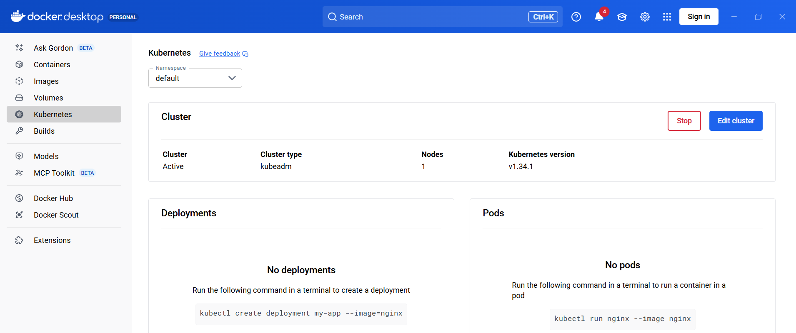
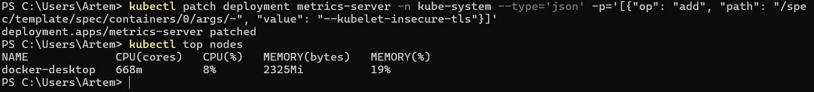
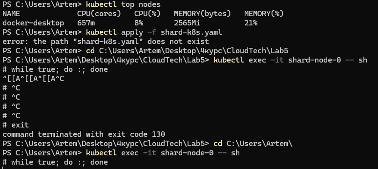
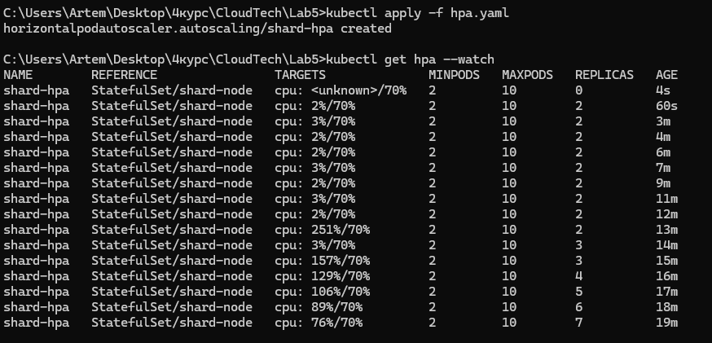
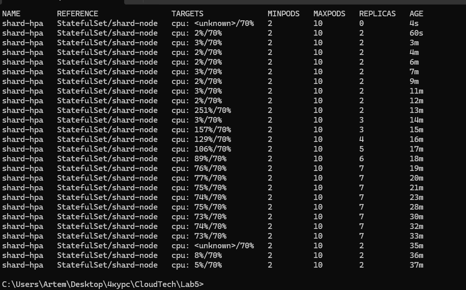

# 1.  Autoscaling Based on Metrics (5 points)

## Configure autoscaling policies for your shards based on metrics from Lab 4
## Scale up when: p99 latency > threshold  (3 points)
## OR CPU > 70% (easier, so 2 point)
## Scale down when: metrics below threshold for N minutes (1 point) 

## Для виконання був обраний шлях переходу на Kubernetes. DockerDesktop має вбудований кластер який складється з одної ноди.

## Запуск Kubernetes в DockerDesktop

## Статус кластеру

## Kubernetes має вбудований механізм — HPA (Horizontal Pod Autoscaler).

### Встановлення Metrics Server, який потрібен для HPA.

### Вивід Metrics Server

## Підготовка  Шардів (StatefulSet)

## Запуск тесту з навантаженням 

## Запуск Автоскейлера (HPA)

## Тут ми бачимо що відбувся зменшення кількості шардів при зменшенні навантаження.

## Scale Down: Після зняття навантаження HPA поступово зменшив кількість подів до мінімального значення (2) згідно з політикою стабілізації
