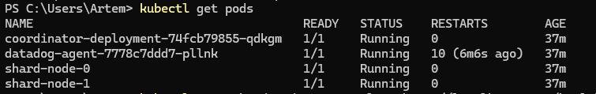
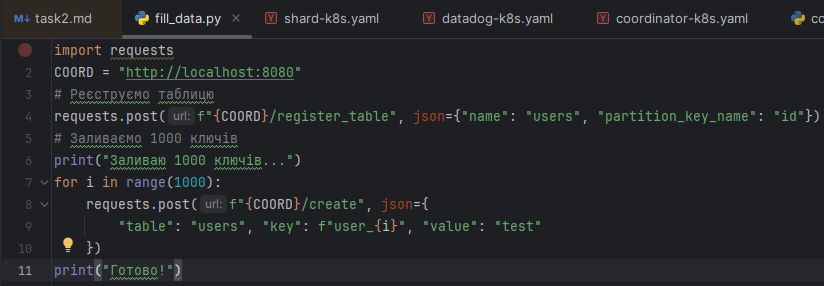
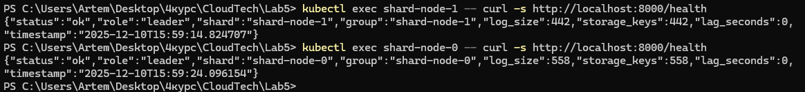
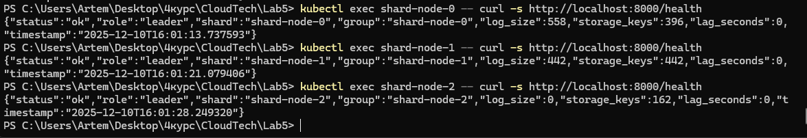
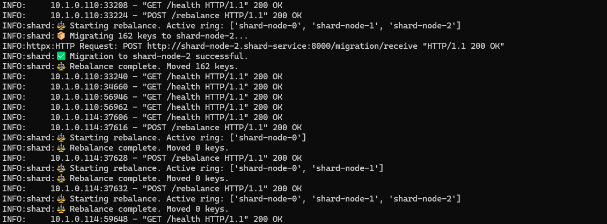

# 1.  Shard rebalancing (6 points):
## a. Implement shard addition: When new shard joins, coordinator should add it to consistent hashing ring (1 point)
## b. Data migration: Implement background job to move keys to new shard based on hash ring changes (3 points)
### Only migrate keys that now belong to different shard (2)
### Keep old shard serving reads until migration completes (1)
## Verify rebalancing: Show that data distribution becomes more even after adding/removing shards (2 points)
### Use metrics from Lab 4 dashboard
### Document before/after shard sizes
 

## Етап 1. Підготовка до початку експеременту.
## Перевіряємо, що у нас 2 поди.

## Запускаємо  скрипт  який створить 1000 ключів.

## Тепер перевіримо, скільки ключів на кожному шарді.

## Стан ДО скейлінгу (2 шарди)

## Етап 2. Масштабування

## Стан ПІСЛЯ скейлінгу (3 шарди)
## Бачимо, що на новій ноді storage_keys = 162

## При виявленні нового доступного шарду (через /health), він автоматично додається у Consistent Hash Ring.

## Data migration (3 points)

## Реалізовано автоматичну міграцію даних при зміні топології:
### Коли Координатор знаходить новий шард, він надсилає команду /rebalance усім активним шардам.
### Старі шарди запускають фоновий процес process_rebalancing.
### Вони перераховують хеші для всіх своїх ключів.
### Ключі, які тепер належать новому шарду, відправляються йому через POST /migration/receive і видаляються локально.

## Verify rebalancing (2 points)

