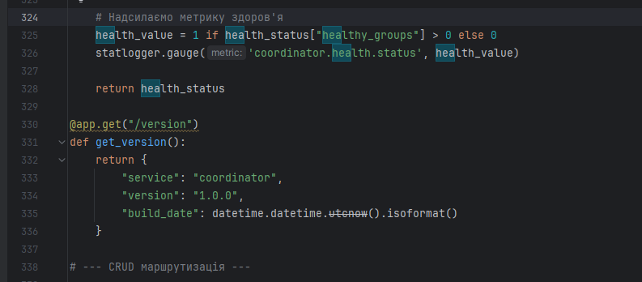
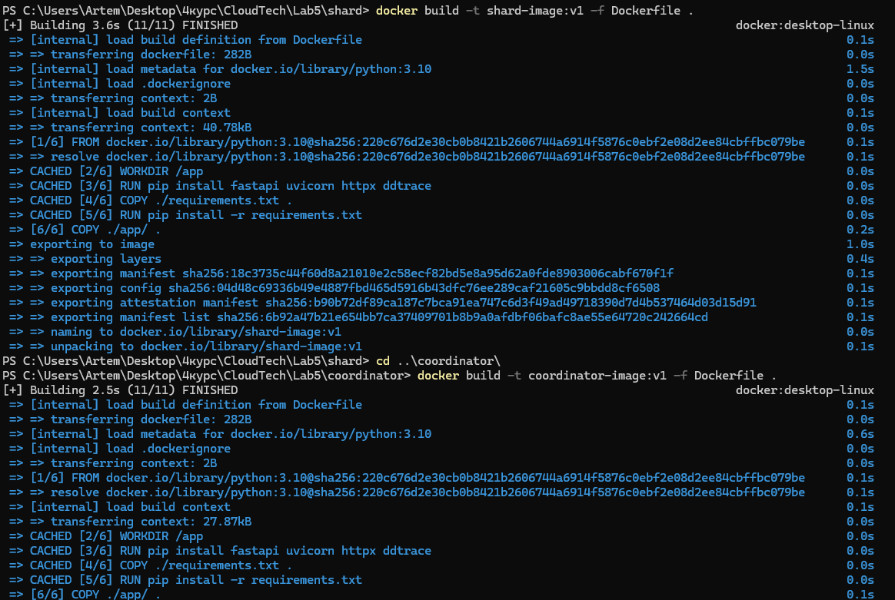
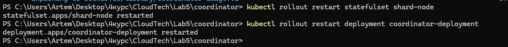
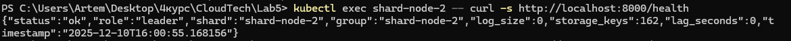

# 3. Health checks: Add actuator (e.g.  /health)  endpoints to coordinator and shards. Also add endpoint returning build version. (2 points)

 
## Додаємо методи 

## Перезбираємо образи

## Перезапускаємо Kubernetes

## Скріншот /health

## Скріншот /version

## Згідно з вимогами, додано ендпоінт /version, який повертає поточну версію мікросервісу та дату збірки. Це корисно для CI/CD процесів, щоб переконатися, що в кластері розгорнуто правильну версію коду. 

