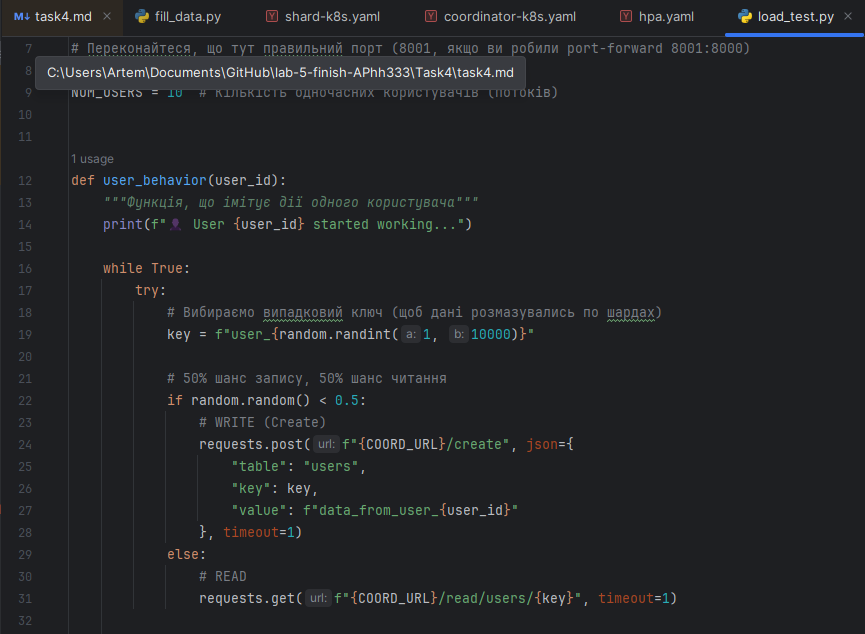
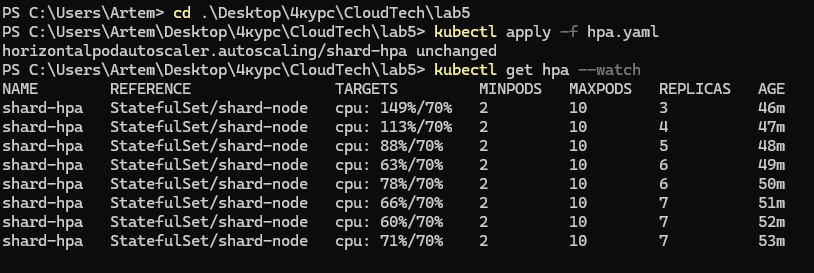
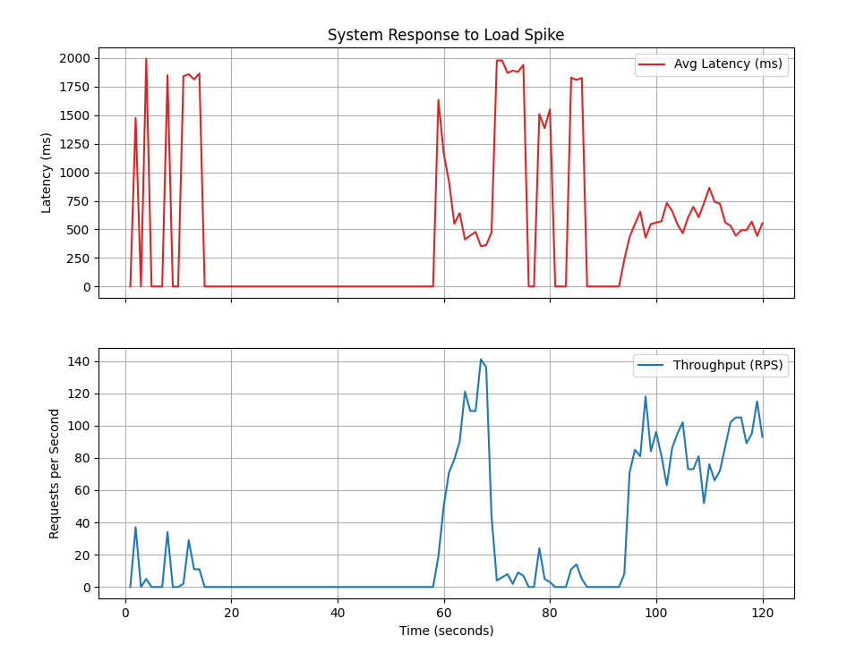

# 4. Optional: Load Testing Report (3 points)
# Run YCSB benchmark (from Lab 3) with autoscaling enabled
# Document how system responds to: gradual load increase, sudden spike, sustained high load
# Show metrics: latency, throughput, number of active nodes over time

 
## Для навантаження було використано скрипт load_test.py

##  Результати навантаження.

## Рещультати навантаження у вигляді графіків.

## Коли навантаження починає зростати, зростає затримка, але коли з'являється новий шард, то затримка падає.

